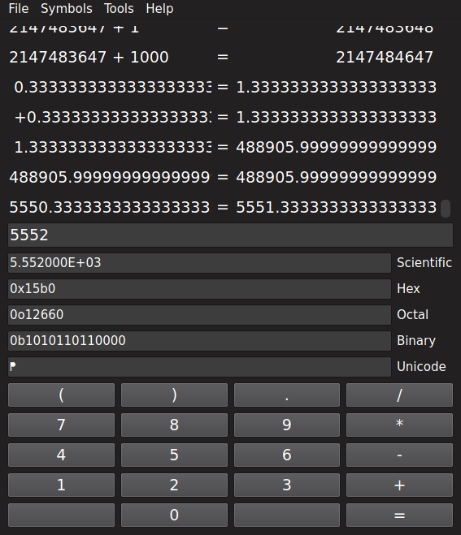

  

# QCalculator
This project aims to provide an accurate, extensible and fast calculator application.

## Features
- 100+ built in arithmetic operations
- Configurable precision
- Warning for inexact results
- Symbol table editor
- Python addons

# Screenshots

# Building
For information on how to build the application see: [BUILDING.md](BUILDING.md)

