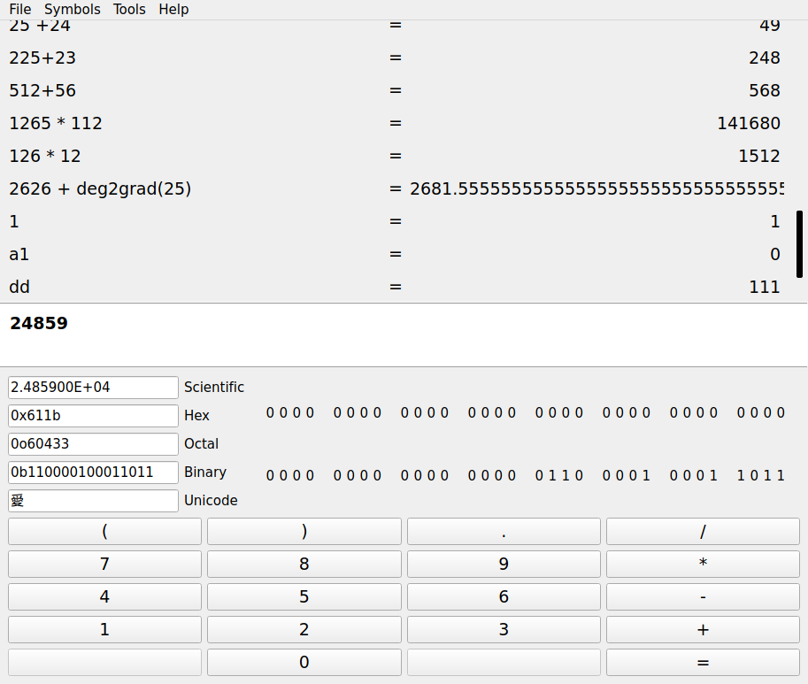
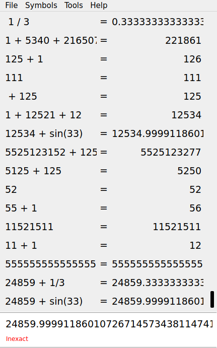

 

# qCalculator
This project aims to provide an accurate, extensible and fast calculator application.

## Features
- 100+ built in arithmetic operations
- Up to 2'147'483'647 decimal digits of precision
- Warning for inexact results
- Symbol table editor
- Python addons

## Addons
The bundle containing the default addons shipped with qCalculator can be downloaded in the [Releases](https://github.com/vetux/qcalculator/releases) 
section of the repository. The archive can be installed by clicking the install button in the "addons" tab of the settings dialog and selecting the downloaded file. 

Addons are python files containing load and unload methods that are called when the user enables the 
addon in the user interface.

Examples of using PySide2 to modify the interface and using exprtk to modify the symbol table aswell as the default addons can be found in [python/addon](python/addon/).

The [python/lib]("python/lib") directory contains the qcalculator packages for interfacing with the native window and symbol table. 
### Addon Bundle
Users can install addons by clicking the install button in the settings/addon options and selecting an archive file containing the file <code>addon_bundle.json</code>.

Addon developers can create addon bundles by selecting the "Create Addon Bundle" option in the "Tools" 
menu or by creating an archive containing the addon_bundle.json and modules / package files.

# Screenshots

# Building
For information on how to build the application see: [BUILDING.md](BUILDING.md)

